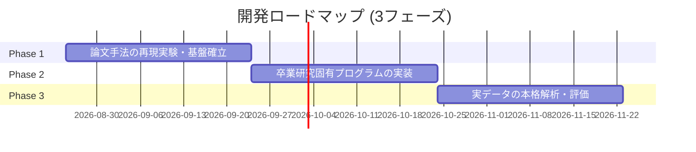

# プロジェクト概要書 (Project Overview)

## 1. プロジェクト基本情報

- **プロジェクト名**: 高密度EEG解析ソフトウェア開発 (High-Density EEG Analysis Software)
- **位置づけ**: 卒業研究 (Graduation Project)
- **対象データ**: 高密度脳波データ (High-Density EEG: 64ch / 128ch)
- **主要言語 / 環境**: Python 3.10+, MNE-Python

---

## 2. 研究背景と目的

### 背景 (Background)
脳波（EEG）計測は高い時間分解能を持つ非侵襲な脳機能計測手法ですが、頭皮上の電位から脳内の発生源（音源）を特定する「逆問題（Inverse Problem）」は数学的に解が一意に定まらない不良設定問題です。
従来、高精度な音源推定（EEG Source Localization: ESL）を行うには被験者個別の構造 MRI（解剖画像）が必要とされてきましたが、臨床現場や実環境（Ecological settings）での研究において全被験者の個別 MRI を取得することはコスト・施設・時間の面で極めて困難です。

### 目的 (Objective)
本プロジェクトでは、**個別 MRI が存在しない実用的な研究環境において、高精度な標準脳テンプレート（MNI-ICBM 2009c）と解剖学的アトラス（CerebrA Atlas）を組み合わせ、高密度EEGデータから信頼性の高い音源推定および脳領域別活動解析を行うソフトウェア基盤を構築すること** を目的とします。

まずは先行研究（*Gomez-Tapia et al., 2025, Frontiers in Neuroimaging*）の解析手法を忠実に再現してベースラインを確立し、その上で今回の卒業研究固有の解析手法・実証実験へと発展させます。

---

## 3. リポジトリ構成

管理コストおよび実証・検証コストを最小限に抑えるため、必要最低限のシンプルな2ディレクトリ構成を採用しています。

```text
graduate-project/
├── CLAUDE.md                       # AI協調・開発ガイドライン
├── docs/                           # 設計書・仕様書・論文ドキュメント
│   ├── exp-reproduce/              # 再現実験用ドキュメント群
│   │   ├── 00-overview.md          # 本ファイル（プロジェクト全体概要）
│   │   ├── 01-openquestion.md      # 未解決課題・検討事項管理表
│   │   ├── 02-processing-flow.md   # 詳細処理フロー設計書
│   │   ├── 03-impl-rule.md         # 実装規約書（モジュール設計・型規約・テスト）
│   │   ├── 04-impl-plan.md         # プログラム設計書（データ受け渡し契約・型定義）
│   │   ├── 05-steps/               # 各ステップ別 main.py 実装計画書 (全8ステップ)
│   │   ├── 06-orchestration.md     # パイプライン・オーケストレーション設計書
│   │   ├── outputs.md              # Phase 1 成果・ノウハウ集約記録
│   │   ├── report/                 # 本手法の数学的定式化技術報告書 (LaTeX / PDF)
│   │   └── paper/
│   │       └── fnimg-4-1479569.pdf # 参照論文 (Gomez-Tapia et al., 2025)
│   └── agy/                        # アーキテクチャ決定記録 (ADR)
├── exp-reproduce/                  # 再現実験プログラム・環境 (Python 3.10)
└── eeg-processing/                 # 本番研究用EEG解析プログラム本体
```

---

## 4. 開発・設計方針 (Design Principles)

1. **Python による最小限の実装**
   - 信頼性の高い標準エコシステム（MNE-Python, NumPy, Pandas 等）を活用し、過度な自作フレームワーク化を避けます。
2. **KISS原則（Keep It Simple, Stupid）**
   - 誰が見てもデータフローと処理内容が一目で追従できる、シンプルで直感的なコード構成を徹底します。
3. **管理・実証コストの最小化**
   - ディレクトリ数やファイル数を必要最小限に留め、実験の再現やデータ検証を素早く行える構造を維持します。
4. **段階的な実証アプローチ**
   - 論文の再現性確認を経てから独自機能の実装に進むことで、解析の妥当性を担保します。
5. **数学的説明性の重視とライブラリ機能の活用（ベクトル化演算の徹底）**
   - 自前での `for` ループを極力避け、NumPy や Pandas 等の実績あるライブラリ機能に頼ることで、数式との一致度・再現性・実行性能を高めます。

---

## 5. 開発ロードマップ



- **Phase 1: EEG処理プログラムの再現実験**
  - 参照論文 (`docs/exp-reproduce/paper/fnimg-4-1479569.pdf`) に基づく前処理、標準脳順モデル構築、eLORETA音源推定、CerebrA領域集約パイプラインを再現・動作検証。
- **Phase 2: 今回の研究におけるプログラムの実装**
  - 卒業研究固有の課題・仮説に合わせた解析手法やデータ抽出ロジックの実装。
- **Phase 3: 実際のデータ解析**
  - 実験で取得した高密度EEGデータに対する解析実行、統計評価、3D可視化および考察。

---

## 6. 関連ドキュメント

- **[CLAUDE.md](file:///Users/shumasui/Documents/school/graduate-project/CLAUDE.md)**: プロジェクト基本ルール & ガイドライン
- **[docs/exp-reproduce/01-openquestion.md](file:///Users/shumasui/Documents/school/graduate-project/docs/exp-reproduce/01-openquestion.md)**: 未解決課題・検討事項管理表
- **[docs/exp-reproduce/02-processing-flow.md](file:///Users/shumasui/Documents/school/graduate-project/docs/exp-reproduce/02-processing-flow.md)**: パイプライン詳細処理フロー設計書
- **[docs/exp-reproduce/03-impl-rule.md](file:///Users/shumasui/Documents/school/graduate-project/docs/exp-reproduce/03-impl-rule.md)**: 実装規約書（モジュール設計・型規約・テスト方針）
- **[docs/exp-reproduce/04-impl-plan.md](file:///Users/shumasui/Documents/school/graduate-project/docs/exp-reproduce/04-impl-plan.md)**: プログラム設計書（モジュール間データ受け渡し契約・型定義）
- **[docs/exp-reproduce/05-steps/](file:///Users/shumasui/Documents/school/graduate-project/docs/exp-reproduce/05-steps/)**: 各ステップ別 `main.py` 実装計画書（Step 0-A 〜 Step 5）
- **[docs/exp-reproduce/06-orchestration.md](file:///Users/shumasui/Documents/school/graduate-project/docs/exp-reproduce/06-orchestration.md)**: パイプライン・オーケストレーション設計書（`main.py` 結合実行設計）
- **[docs/exp-reproduce/outputs.md](file:///Users/shumasui/Documents/school/graduate-project/docs/exp-reproduce/outputs.md)**: Phase 1 成果・ノウハウ集約記録
- **[docs/exp-reproduce/report/](file:///Users/shumasui/Documents/school/graduate-project/docs/exp-reproduce/report/)**: 本手法のステップ別数学的定式化技術報告書（LaTeX / PDF）
- **[docs/agy/](file:///Users/shumasui/Documents/school/graduate-project/docs/agy/)**: アーキテクチャ決定記録 (ADR)
- **[docs/exp-reproduce/paper/fnimg-4-1479569.pdf](file:///Users/shumasui/Documents/school/graduate-project/docs/exp-reproduce/paper/fnimg-4-1479569.pdf)**: 参照論文 (*Evaluation of EEG pre-processing and source localization in ecological research*)
