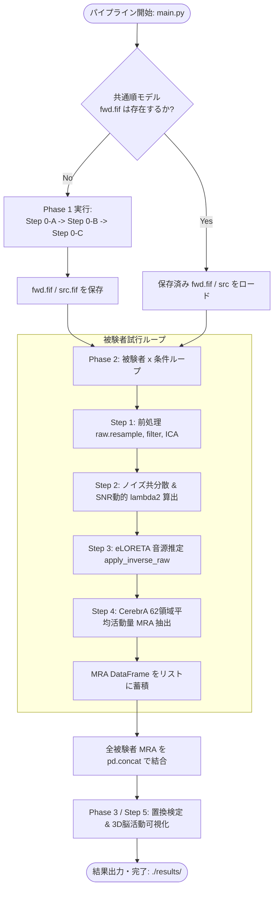

# パイプライン・オーケストレーション設計書 (Orchestration Design)

本ドキュメントは、[04-impl-plan.md](file:///Users/shumasui/Documents/school/graduate-project/docs/exp-reproduce/04-impl-plan.md) および [05-steps/](file:///Users/shumasui/Documents/school/graduate-project/docs/exp-reproduce/05-steps/) で定義された各独立モジュールを結合し、`exp-reproduce/main.py` において一連の解析フローを統括実行するためのオーケストレーション設計書です。

---

## 1. オーケストレーション設計の基本原則 (KISS 原則)

1. **極限までシンプルな線形データフロー (KISS原則)**
   - Airflow や Prefect、Celery といった複雑なワークフローエンジンの導入は一切行いません。
   - 純粋な Python スクリプト（関数呼び出し、標準の `for` ループ、例外処理）のみで構築し、誰が見ても処理の依存関係が一目で分かるようにします。
2. **Phase 1（共通モデル）のスマートキャッシュ**
   - 順モデル（Lead Field 行列）や BEM 解の計算には一定の時間を要するため、ディスク上に計算済みファイルが存在する場合は再計算をスキップして高速にロードします。
3. **被験者ループの耐障害性 (Fault Tolerance)**
   - 1 人の被験者データに破損や欠損があってもパイプライン全体を停止させず、エラーをログに記録して次の被験者の処理を継続します。
4. **透明性の高いログ出力**
   - 各ステップの開始・完了、算出された SNR、適用された $\lambda^2$、所要時間をコンソールに分かりやすく表示します。

---

## 2. 全体オーケストレーション構造図



---

## 3. `exp-reproduce/main.py` の実装仕様

```python
"""
exp-reproduce/main.py
高密度EEG解析再現実験 全体オーケストレーション・スクリプト
"""
import os
import sys
import time
import logging
from pathlib import Path
from typing import List
import pandas as pd
import mne

# --- Phase 1: 共通モデルモジュール ---
from modules.step0a_geometry_bem.main import run_geometry_bem
from modules.step0a_geometry_bem.types import GeometryBEMConfig
from modules.step0b_atlas_source.main import run_atlas_source
from modules.step0b_atlas_source.types import AtlasSourceConfig
from modules.step0c_forward_model.main import run_forward_model
from modules.step0c_forward_model.types import ForwardModelConfig

# --- Phase 2: データ解析モジュール ---
from modules.step1_preprocessing.main import run_preprocessing
from modules.step1_preprocessing.types import PreprocessingConfig
from modules.step2_noise_covariance.main import run_noise_covariance
from modules.step2_noise_covariance.types import NoiseCovConfig
from modules.step3_source_localization.main import run_source_localization
from modules.step3_source_localization.types import SourceLocConfig
from modules.step4_parcellation.main import run_parcellation
from modules.step4_parcellation.types import SubjectMetadata
from modules.step5_stats_visualization.main import run_stats_visualization
from modules.step5_stats_visualization.types import StatsVizConfig

# ログ設定
logging.basicConfig(
    level=logging.INFO,
    format="[%(asctime)s] [%(levelname)s] %(message)s",
    datefmt="%H:%M:%S"
)
logger = logging.getLogger("Orchestrator")


def prepare_common_models(
    template_nii_path: str,
    cerebra_nii_path: str,
    cerebra_csv_path: str,
    subjects_dir: str,
    montage_name: str = "GSN-HydroCel-128",
    force_recompute: bool = False
):
    """
    Phase 1: 全被験者共通の幾何モデル・ソース空間・順モデルを準備する。
    すでにディスク上に存在する場合は高速ロードする。
    """
    logger.info("=== [Phase 1] 共通モデルの準備 ===")
    
    # 1. Step 0-A: BEM モデル
    bem_cfg = GeometryBEMConfig(
        template_nii_path=template_nii_path,
        subjects_dir=subjects_dir,
        overwrite=force_recompute
    )
    bem_out = run_geometry_bem(bem_cfg)
    
    # 2. Step 0-B: ソース空間 & アトラス
    atlas_cfg = AtlasSourceConfig(
        cerebra_nii_path=cerebra_nii_path,
        cerebra_csv_path=cerebra_csv_path,
        overwrite=force_recompute
    )
    src_out = run_atlas_source(bem_out, atlas_cfg)
    
    # 3. Step 0-C: 順モデル (Lead Field)
    fwd_cfg = ForwardModelConfig(
        montage_name=montage_name,
        overwrite=force_recompute
    )
    fwd_out = run_forward_model(bem_out, src_out, fwd_cfg)
    
    logger.info("共通順モデルの準備完了: ソース点数=%d, 電極数=%d", 
                src_out.total_sources, fwd_out.forward['nchan'])
    return bem_out, src_out, fwd_out


def run_pipeline(
    data_dir: str,
    subject_ids: List[str],
    conditions: List[str],
    output_dir: str = "./results",
    force_recompute_common: bool = False
):
    """
    全体パイプラインの実行エントリーポイント
    """
    start_time = time.time()
    logger.info("高密度EEG解析パイプラインを開始します")
    os.makedirs(output_dir, exist_ok=True)
    
    # -------------------------------------------------------------
    # 1. 共通モデルの構築 (Phase 1)
    # -------------------------------------------------------------
    template_nii = "docs/exp-reproduce/mni_icbm152_nlin_sym_09c_CerebrA_minc2/mni_icbm152_t1_tal_nlin_sym_09c.nii"
    cerebra_nii = "docs/exp-reproduce/mni_icbm152_nlin_sym_09c_CerebrA_minc2/CerebrA.nii"
    cerebra_csv = "docs/exp-reproduce/mni_icbm152_nlin_sym_09c_CerebrA_minc2/CerebrA_LabelDetails.csv"
    subjects_dir = "./subjects"
    
    bem_out, src_out, fwd_out = prepare_common_models(
        template_nii_path=template_nii,
        cerebra_nii_path=cerebra_nii,
        cerebra_csv_path=cerebra_csv,
        subjects_dir=subjects_dir,
        force_recompute=force_recompute_common
    )
    
    # -------------------------------------------------------------
    # 2. 各被験者・条件の解析 (Phase 2)
    # -------------------------------------------------------------
    logger.info("=== [Phase 2] 被験者データ解析開始 (被験者数: %d) ===", len(subject_ids))
    all_mra_records: List[pd.DataFrame] = []
    
    for sub in subject_ids:
        for cond in conditions:
            raw_path = os.path.join(data_dir, f"{sub}_{cond}_raw.fif")
            if not os.path.exists(raw_path):
                logger.warning("データが存在しないためスキップします: %s", raw_path)
                continue
            
            logger.info("処理中: 被験者=%s, 条件=%s", sub, cond)
            try:
                # Step 1: 前処理 (ダウンサンプル、フィルタ、PREP、ICA)
                prep_cfg = PreprocessingConfig(raw_eeg_path=raw_path)
                eeg_out = run_preprocessing(prep_cfg)
                
                # Step 2: ノイズ共分散 & 動的正則化パラメータ算出
                cov_cfg = NoiseCovConfig()
                cov_out = run_noise_covariance(eeg_out, cov_cfg)
                logger.info("  -> SNR: %.2f dB, lambda2: %.4f", cov_out.snr_db, cov_out.lambda2)
                
                # Step 3: eLORETA 音源推定
                loc_cfg = SourceLocConfig(method="eLORETA")
                stc_out = run_source_localization(fwd_out, eeg_out, cov_out, loc_cfg)
                
                # Step 4: CerebrA 領域平均活動量 (MRA) 集約
                meta = SubjectMetadata(subject_id=sub, condition=cond)
                parc_out = run_parcellation(stc_out, src_out, meta)
                
                all_mra_records.append(parc_out.mra_df)
            except Exception as e:
                logger.error("被験者 %s 条件 %s の処理中にエラーが発生しました: %s", sub, cond, str(e), exc_info=True)
    
    if not all_mra_records:
        logger.error("処理可能なデータがありませんでした。終了します。")
        return
    
    # 全被験者・全条件の整然 DataFrame を結合
    all_subjects_mra_df = pd.concat(all_mra_records, ignore_index=True)
    mra_csv_path = os.path.join(output_dir, "all_subjects_mra.csv")
    all_subjects_mra_df.to_csv(mra_csv_path, index=False)
    logger.info("全被験者の領域活動量データを保存しました: %s", mra_csv_path)
    
    # -------------------------------------------------------------
    # 3. 統計検定 & 3D可視化 (Phase 3 / Step 5)
    # -------------------------------------------------------------
    logger.info("=== [Phase 3] 統計検定 (置換検定) & 可視化開始 ===")
    viz_cfg = StatsVizConfig(
        condition_a=conditions[0],
        condition_b=conditions[1],
        output_dir=output_dir
    )
    stats_out = run_stats_visualization(all_subjects_mra_df, viz_cfg)
    
    elapsed = time.time() - start_time
    logger.info("=== パイプライン全工程が正常に完了しました (所要時間: %.1f 秒) ===", elapsed)
    logger.info("統計結果ファイル: %s", os.path.join(output_dir, "permutation_test_results.csv"))


if __name__ == "__main__":
    # 実行例（サンプル被験者と条件）
    run_pipeline(
        data_dir="./data",
        subject_ids=["sub-01", "sub-02"],
        conditions=["rest", "video1"],
        output_dir="./results"
    )
```

---

## 4. コーディングエージェント向け実装時の注意点

1. **モジュール直接インポートの徹底**:
   - 必ず `from modules.stepXX_name.main import run_stepXX` および `from modules.stepXX_name.types import ConfigXX` の形式でインポートし、各ステップの内部プライベート関数を呼び出さないこと。
2. **中間変数のライフサイクル管理**:
   - `stc`（ソース空間時系列データ）は 3 万点 $\times$ 時間長の巨大な NumPy 配列を持つため、Step 4 で `mra_df`（62領域平均値）を抽出した後は不要な `stc` オブジェクトを保持し続けないこと（メモリリーク防止）。
3. **再現性のためのシード固定**:
   - ICA や置換検定など乱数を利用するステップには、Config 経由で固定の `random_state=42` を明示的に渡すこと。
